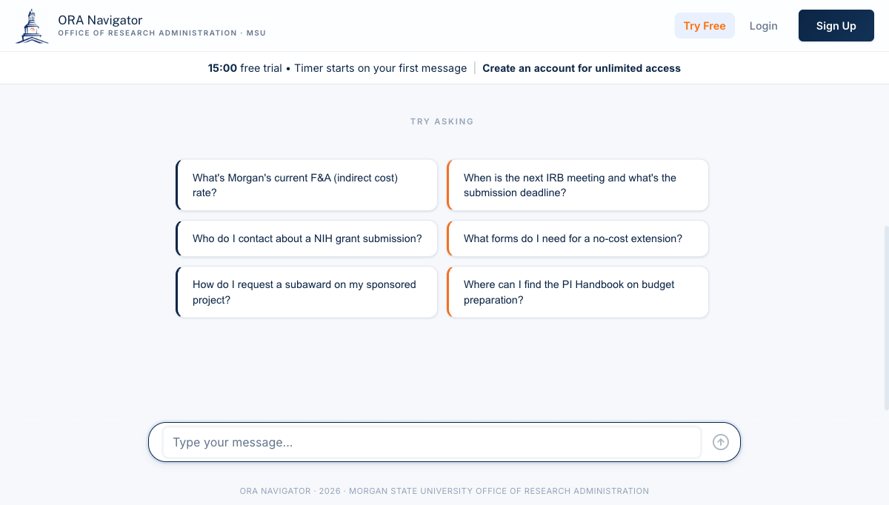
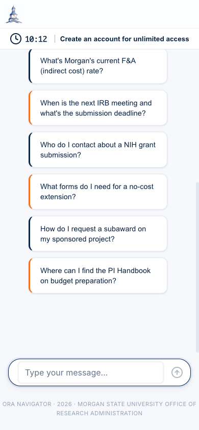
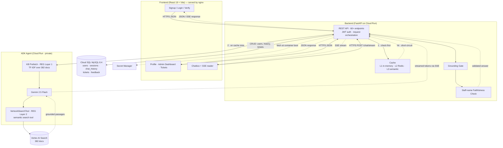

<h1 align="center">ORA Navigator</h1>
<p align="center"><strong>AI Assistant for Morgan State University's Office of Research Administration</strong></p>
<p align="center">
  <a href="https://ora.inavigator.ai">Live App</a> |
  <a href="#architecture">Architecture</a> |
  <a href="#local-development">Local Development</a> |
  <a href="#deployment">Deployment</a>
</p>
<p align="center">
  
  
  
  
</p>

---

ORA Navigator is an AI assistant for Morgan State University's Office of Research Administration (ORA). It serves **faculty, principal investigators, research staff, and department administrators** — not students. Users ask questions about grants, compliance, pre-award, post-award, forms, and ORA staff contacts in plain English and get answers grounded in 382 official documents scraped from `morgan.edu/office-of-research-administration` and its subpages.

Built with Google ADK (Agent Development Kit), Gemini 2.5 Flash, and Vertex AI Search. A **Retrieval-Enforced Generation (REG)** pipeline grounds answers at three layers: KB prefetch (TF-IDF), tool-based retrieval (VertexAiSearchTool), and a post-generation grounding gate + staff-name faithfulness check.

Deployed on Google Cloud Run with multi-instance scaling, Cloud SQL session persistence, and a layered cache (L1 in-memory + L2 Redis + L3 semantic).

---

## Screenshots

<p align="center">
  
</p>

<p align="center">
  
</p>

---

## What ORA Navigator answers

| Area | Examples |
|---|---|
| **Pre-Award** | F&A and fringe rates · institutional IDs (UEI, EIN, FWA, IRB number) · proposal submission steps · sponsor opportunity databases |
| **Compliance** | IRB approval timeline + meeting schedule · IACUC SOPs (50 documents) · COI disclosure flow · RCR training · Research Security |
| **Post-Award** | NCE (No-Cost Extension) 60-day rule · subaward setup · effort reporting (14-day Searchlight) · final reports (90-day) |
| **Forms & Policies** | PI Handbook policies · 271 forms (PDFs, DocuSign, IACUC SOPs, RACC, D-RED slides) · request templates |
| **Staff routing** | Function-to-staff lookup · ORA staff directory (14 people) · ask.ora@morgan.edu mailing list |

---

## Beyond chat — proposal workflow & tools

ORA Navigator is more than a chatbot. It also gives PIs a place to *run* a proposal:

| Tool | What it does |
|---|---|
| **Forms catalog** (`/forms`) | One-click browse of every ORA form / template / DocuSign PDF, filterable by category, sponsor, and role — no LLM call, no hallucinated links. |
| **Proposals tracker** (`/my-proposals`) | Per-submission task checklists seeded from sponsor templates. Each task with a known form shows an **"Open form"** link resolved from its `kb_doc_id`. |
| **Calendar export** | Deadlines export to any calendar app via a scoped, replay-safe token feed — **download `.ics`** or subscribe over `webcal://` (`GET /api/me/deadlines.ics`). |
| **Solicitation Ingestion** (AI) | Drop a sponsor PDF → Gemini extracts deadline, page limits, and required attachments (with source-quote verification) → review → seed a tracked submission. |
| **Draft Critic** (AI) | Pre-submission check of a draft PDF against the reconstructed solicitation rules — deterministic verdict plus an evidence-verified advisory AI review. |
| **Budget Helper** (AI) | Split-view grant-budget builder: enter people/effort, equipment, travel, supplies, subawards → a live **Direct → MTDC → F&A → Total** summary with a sponsor-cap badge. All math is **deterministic** (real Morgan F&A/fringe rates, MTDC exclusions); the LLM only drafts the justification prose (figures injected, never invented). The cap auto-prefills from the solicitation. |
| **Compliance Sentinel** (deterministic) | "Which approvals do I need?" — a short yes/no questionnaire plus the proposal's sponsor drive a **deterministic** checklist (IRB · IACUC · COI · RCR · Export Control / Research Security), each item marked **Required / Review / Not required** with a plain-English why, a timing note, and a verified KB form link. No LLM decides anything; required items can be one-click added to the proposal as tasks. |
| **Deadline Watcher** (AI) | Emails PIs at 14/7/3/1/0 days out (idempotent per submission+threshold), with an AI-personalized body and a hard fallback to a deterministic template. |

---

## Architecture

The diagram below shows the **full** request topology — not just chat. Every browser-side component (signup, login, profile, admin, chat) talks only to the REST API, which is the sole entry point. Cache and ADK Agent are dependencies of the REST API, not peers — they never talk to the browser directly. Solid arrows are request paths; dashed arrows are the return paths the REST API serves back over the same HTTP/SSE connection.



**Why the diagram looks this way:**

- The frontend has many components (auth, profile, admin, chat) — **only chat hits the cache + ADK path**. Signup, login, profile updates, ticket CRUD, and admin actions are plain REST → SQL.
- Every HTTP response physically travels back through the REST API to the browser over the same connection. The Grounding Gate and Faithfulness Check do **not** talk to the browser directly — they hand validated output back to the REST API, which streams it.
- The cache is checked **before** calling Gemini. On a hit, the request never reaches ADK Agent — saving a full LLM round-trip.
- "REG Layer 1/2" (retrieval inside ADK) and "L1/L2/L3" (cache layers in the backend) are unrelated concepts that happen to share the word "layer." Cache prevents calling the LLM; REG layers feed the LLM with KB context once it's called.

### Three services on Cloud Run

| Service | URL | Auth | Purpose |
|---|---|---|---|
| Frontend | `oranavigator-frontend` | public | React UI behind nginx, served at https://ora.inavigator.ai |
| Backend | `oranavigator-backend` | public | FastAPI: auth, sessions, chat orchestration, admin |
| ADK Agent | `oranavigator-adk` | private (backend → ADK only) | Google ADK + Gemini + KB tool |

### GCP resources (project `infra-vertex-494621-v1`)

- **Cloud SQL**: `oranavigator-db` (db-g1-small, us-central1, public IP `34.173.108.181`)
- **Vertex AI Search datastore**: `oranavigator-kb-v8` (location `us`, 382 docs)
- **Service account**: `oranavigator-backend@infra-vertex-494621-v1.iam.gserviceaccount.com`
- **Artifact Registry**: `oranavigator` Docker repo in us-central1
- **Secret Manager**: `ora-database-url`, `ora-jwt-secret`, `ora-admin-email`, `ora-admin-password`
- **Domain**: `ora.inavigator.ai` → `oranavigator-frontend` (managed cert)

---

## Tech Stack

- **Frontend**: React 19, Vite, react-router, react-icons, PWA (Vite-PWA)
- **Backend**: FastAPI, SQLAlchemy, bcrypt, JWT auth, cachetools (L1), redis-py (L2), text-embedding-004 cosine (L3)
- **AI Agent**: Google ADK, Gemini 2.5 Flash, Vertex AI Search
- **Database**: Cloud SQL MySQL 8.4 (TCP+SSL locally, unix socket via Cloud SQL Auth Proxy in Cloud Run)
- **Deployment**: Cloud Run, Cloud Build, Artifact Registry, Secret Manager
- **CI/CD**: GitHub Actions (lint, test, health-check; deploys via `deploy-cloudrun.sh`)

---

## Local Development

```bash
# 0. Install Python deps in venv, npm deps in frontend
python -m venv .venv && source .venv/bin/activate
pip install -r backend/requirements.txt
(cd frontend && npm install)

# 1. ADK Agent on port 8081
cd adk_agent && adk web . --port 8081

# 2. Backend on port 5002
cd backend && uvicorn main:app --host 127.0.0.1 --port 5002

# 3. Frontend on port 3001
cd frontend && npm run dev -- --port 3001
```

Copy `.env.example` to `.env` and fill in `DATABASE_URL`, `JWT_SECRET`, `GOOGLE_CLOUD_PROJECT`. See `STARTUP.md` for short version.

Cloud SQL local connection requires your laptop's public IP in the authorized networks list:

```bash
gcloud sql instances patch oranavigator-db \
  --authorized-networks=<your-ip>/32 \
  --project=infra-vertex-494621-v1
```

---

## Knowledge Base

The KB lives at `backend/kb_structured/` as 382 JSON files plus a master `_all_documents.jsonl` index. Files are organized as a **hierarchical tree** mirroring the live `morgan.edu/office-of-research-administration` left-sidebar nav:

| Folder | Docs | Purpose |
|---|---:|---|
| `research_compliance/` | 146 | IRB (incl. meeting schedule + voting roster), IACUC (50 SOPs), COI, RCR, Research Security |
| `trainings/` | 115 | eTraining modules, New Faculty Development Seminars, workshops, monthly D-RED |
| `pre_award/` | 30 | F&A & fringe rates, UEI/EIN/FWA, proposal submission steps, budget development |
| `policies_and_guidelines/` | 22 | PI Handbook 5 — overview + 20 numbered policies |
| `about/` | 19 | Office overview, history, staff directory |
| `resources/` | 17 | PI handbooks, letter & form templates |
| `funding_sources/` | 15 | Federal/foundation funding databases + sponsor categories |
| `post_award/` | 15 | Account setup, NCE, subawards, effort & financial reporting |
| `ora_announcements/` | 3 | Listserv subscription, Common Forms, compliance leadership updates |
| **Total** | **382** | indexed into Vertex AI Search datastore `oranavigator-kb-v8` |

The 382 JSON files are uploaded to a Vertex AI Search datastore (`oranavigator-kb-v8`). The ADK agent queries the datastore at runtime via `VertexAiSearchTool` — it does not read the local files.

---

## Deployment

Cloud Run deploy is handled by `deploy-cloudrun.sh`:

```bash
# Full setup (first time): IAM, secrets, Artifact Registry
./deploy-cloudrun.sh setup

# Deploy all 3 services
./deploy-cloudrun.sh
```

Domain `ora.inavigator.ai` is mapped to `oranavigator-frontend` via Cloud Run domain mapping with a managed TLS cert.

CI (`.github/workflows/ci.yml`) runs on every push: lint, tests, health-check against the live backend and frontend. CI does not auto-deploy.

---

## Documentation

A complete, plain-English technical guide to the whole system — every feature, the chat/RAG pipeline, the memory system, the self-healing research pipeline, the proposal-workflow agents and tools (Solicitation Ingestion, Draft Critic, Budget Helper, Compliance Sentinel, Deadline Watcher), all database tables, every cron job, and a "where is each artifact saved" reference — lives in `docs/`:

- `docs/ORA_Navigator_Complete_Guide.html` — the assembled 11-chapter guide (open in a browser)
- `docs/sections/` — the per-chapter HTML sources
- `docs/build_guide.py` — rebuilds the guide; render to PDF with headless Chrome `--print-to-pdf` (the PDF itself is git-ignored)

Quick-start lives in `STARTUP.md`; this `README` covers architecture and deployment; `CLAUDE.md` holds the deep operational notes.

---

## Security

See `SECURITY.md`. Highlights:

- JWT tokens with bcrypt password hashing
- `.morgan.edu` email domain restriction at signup (auth router enforces)
- Email verification flow
- Grounding gate prevents hallucinated KB facts
- Staff-name faithfulness check appends a disclaimer if the model invents an ORA staff name not on the authoritative list
- CORS restricted to known origins, file upload validation, rate limiting on guest chat and registration

---

## License

MIT — see `LICENSE`.
