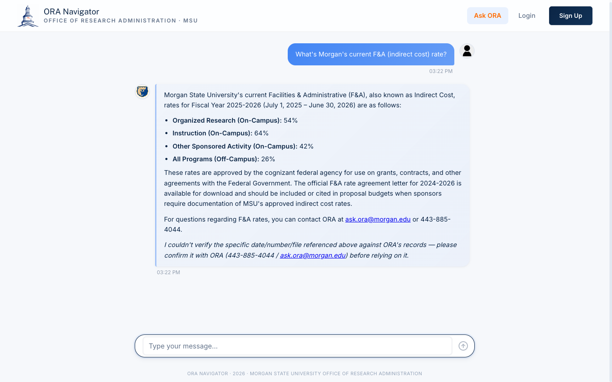
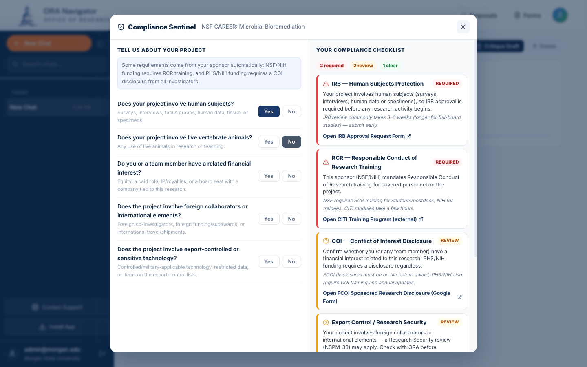
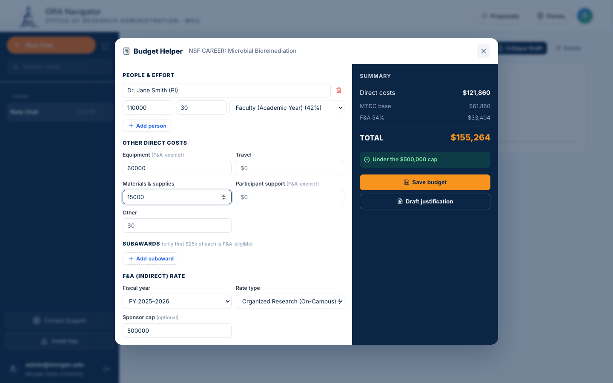
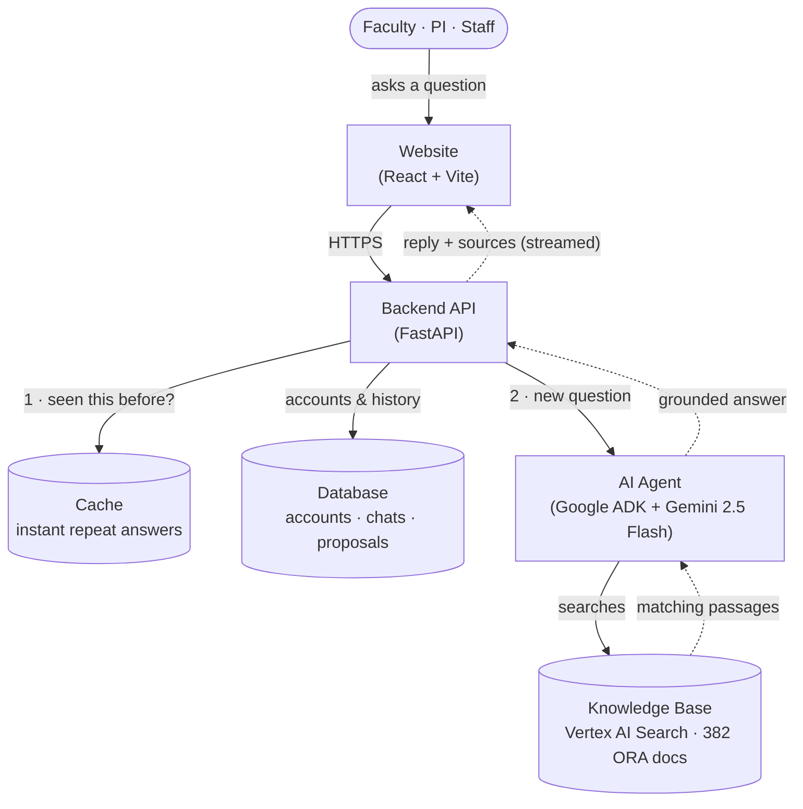

<h1 align="center">ORA Navigator</h1>
<p align="center"><strong>AI Assistant for Morgan State University's Office of Research Administration</strong></p>
<p align="center">
  <a href="https://ora.inavigator.ai">Live App</a> |
  <a href="#architecture">Architecture</a> |
  <a href="#local-development">Local Development</a> |
  <a href="#deployment">Deployment</a>
</p>
<p align="center">
  
  
  
  
</p>

---

ORA Navigator is an AI assistant for Morgan State University's Office of Research Administration (ORA). It serves **faculty, principal investigators, research staff, and department administrators** — not students. Users ask questions about grants, compliance, pre-award, post-award, forms, and ORA staff contacts in plain English and get answers grounded in 382 official documents scraped from `morgan.edu/office-of-research-administration` and its subpages.

Built with **Google ADK, Gemini 2.5 Flash, and Vertex AI Search**. The core idea: the AI may only answer from Morgan's documents. Before replying, it searches the knowledge base, drafts an answer, and a final check confirms the answer is actually backed by what it found — if not, it refuses rather than guessing. That's what makes the answers trustworthy.

Runs on **Google Cloud Run** with a layered cache so common questions come back instantly, and Cloud SQL for accounts, chat history, and proposals.

---

## Screenshots

| Ask anything — grounded, no login needed | Real answers, with the morgan.edu source |
|---|---|
|  |  |
| **Compliance Sentinel** — which approvals your project needs | **Budget Helper** — the F&A (overhead) math, done right |
|  |  |

---

## What you can ask

Ask in plain English. Every answer comes from Morgan's **official ORA documents** and links back to the source page — so you can trust it and verify it. For example:

- **Grants & money** — *"What's Morgan's F&A (indirect cost) rate?"* · *"What's our UEI / EIN / FWA number?"*
- **Compliance** — *"How long does IRB approval take, and when does the IRB meet?"* · *"Where are the IACUC SOPs?"* · *"How do I disclose a conflict of interest?"*
- **After the award** — *"What's the No-Cost Extension deadline?"* · *"How do I set up a subaward?"* · *"How does effort reporting work?"*
- **Forms & people** — *"What form do I need to add a co-investigator?"* · *"Who do I contact about an NIH submission?"*

Behind the scenes it searches **382 documents** scraped from `morgan.edu/office-of-research-administration` — policies, forms, IRB/IACUC procedures, funding sources, and the ORA staff directory.

---

## More than a chatbot — tools to *run* a proposal

ORA Navigator also helps faculty manage a grant from idea to award:

| Tool | What it does, in plain words |
|---|---|
| **Forms catalog** | Browse and open every ORA form in one click — filter by category, sponsor, or role. No chatbot, no made-up links. |
| **Proposals tracker** | Keep each grant proposal with a checklist of what's due and a countdown to the deadline. |
| **Solicitation reader** (AI) | Upload the sponsor's PDF and the AI pulls out the deadline, page limits, and required documents — then builds your checklist. You review every field before it's saved. |
| **Draft Critic** (AI) | Upload your draft and it checks page limits, required sections, and budget against the rules — *before* you submit. |
| **Budget Helper** | Build a grant budget with the tricky **F&A (overhead) math done correctly** — the one rule PIs most often get wrong. Every number is computed by code, not the AI. |
| **Compliance Sentinel** | Answer a few yes/no questions and it tells you exactly which approvals you need — **IRB, animal care (IACUC), conflict-of-interest, ethics training, export control** — with the right Morgan form for each. |
| **Deadline reminders** | Automatic emails as each deadline gets close, plus a one-click **calendar (`.ics`) export** so deadlines show up in your own calendar app. |

> **Why you can trust the numbers:** for anything that has to be exact — budget math, which compliance approvals apply — the answer is produced by **plain code, not the AI**. The AI only writes prose (like a budget justification) using figures the code already computed. It never invents a number.

---

## Architecture

Here's the whole system in one picture. You ask a question on the website; one backend handles everything; new questions go to the AI agent, which **only answers from the knowledge base** and streams the reply back with its sources.



**How to read it:**

1. Every screen (login, chat, proposals, admin) talks to **one** backend — the single front door.
2. The backend checks the **cache first** — if that question was answered recently, it replies instantly without calling the AI.
3. A new question goes to the **AI agent**, which **searches the knowledge base and answers only from what it finds** (this is what keeps answers grounded and prevents made-up facts). The reply streams back to your screen with links to the source pages.

### Three services on Cloud Run

| Service | URL | Auth | Purpose |
|---|---|---|---|
| Frontend | `oranavigator-frontend` | public | React UI behind nginx, served at https://ora.inavigator.ai |
| Backend | `oranavigator-backend` | public | FastAPI: auth, sessions, chat orchestration, admin |
| ADK Agent | `oranavigator-adk` | private (backend → ADK only) | Google ADK + Gemini + KB tool |

### GCP resources (project `infra-vertex-494621-v1`)

- **Cloud SQL**: `oranavigator-db` (db-g1-small, us-central1, public IP `34.173.108.181`)
- **Vertex AI Search datastore**: `oranavigator-kb-v8` (location `us`, 382 docs)
- **Service account**: `oranavigator-backend@infra-vertex-494621-v1.iam.gserviceaccount.com`
- **Artifact Registry**: `oranavigator` Docker repo in us-central1
- **Secret Manager**: `ora-database-url`, `ora-jwt-secret`, `ora-admin-email`, `ora-admin-password`
- **Domain**: `ora.inavigator.ai` → `oranavigator-frontend` (managed cert)

---

## Tech Stack

- **Frontend**: React 19, Vite, react-router, react-icons, PWA (Vite-PWA)
- **Backend**: FastAPI, SQLAlchemy, bcrypt, JWT auth, cachetools (L1), redis-py (L2), text-embedding-004 cosine (L3)
- **AI Agent**: Google ADK, Gemini 2.5 Flash, Vertex AI Search
- **Database**: Cloud SQL MySQL 8.4 (TCP+SSL locally, unix socket via Cloud SQL Auth Proxy in Cloud Run)
- **Deployment**: Cloud Run, Cloud Build, Artifact Registry, Secret Manager
- **CI/CD**: GitHub Actions (lint, test, health-check; deploys via `deploy-cloudrun.sh`)

---

## Local Development

```bash
# 0. Install Python deps in venv, npm deps in frontend
python -m venv .venv && source .venv/bin/activate
pip install -r backend/requirements.txt
(cd frontend && npm install)

# 1. ADK Agent on port 8081
cd adk_agent && adk web . --port 8081

# 2. Backend on port 5002
cd backend && uvicorn main:app --host 127.0.0.1 --port 5002

# 3. Frontend on port 3001
cd frontend && npm run dev -- --port 3001
```

Copy `.env.example` to `.env` and fill in `DATABASE_URL`, `JWT_SECRET`, `GOOGLE_CLOUD_PROJECT`. See `STARTUP.md` for short version.

Cloud SQL local connection requires your laptop's public IP in the authorized networks list:

```bash
gcloud sql instances patch oranavigator-db \
  --authorized-networks=<your-ip>/32 \
  --project=infra-vertex-494621-v1
```

---

## Knowledge Base

The KB lives at `backend/kb_structured/` as 382 JSON files plus a master `_all_documents.jsonl` index. Files are organized as a **hierarchical tree** mirroring the live `morgan.edu/office-of-research-administration` left-sidebar nav:

| Folder | Docs | Purpose |
|---|---:|---|
| `research_compliance/` | 146 | IRB (incl. meeting schedule + voting roster), IACUC (50 SOPs), COI, RCR, Research Security |
| `trainings/` | 115 | eTraining modules, New Faculty Development Seminars, workshops, monthly D-RED |
| `pre_award/` | 30 | F&A & fringe rates, UEI/EIN/FWA, proposal submission steps, budget development |
| `policies_and_guidelines/` | 22 | PI Handbook 5 — overview + 20 numbered policies |
| `about/` | 19 | Office overview, history, staff directory |
| `resources/` | 17 | PI handbooks, letter & form templates |
| `funding_sources/` | 15 | Federal/foundation funding databases + sponsor categories |
| `post_award/` | 15 | Account setup, NCE, subawards, effort & financial reporting |
| `ora_announcements/` | 3 | Listserv subscription, Common Forms, compliance leadership updates |
| **Total** | **382** | indexed into Vertex AI Search datastore `oranavigator-kb-v8` |

The 382 JSON files are uploaded to a Vertex AI Search datastore (`oranavigator-kb-v8`). The ADK agent queries the datastore at runtime via `VertexAiSearchTool` — it does not read the local files.

---

## Deployment

Cloud Run deploy is handled by `deploy-cloudrun.sh`:

```bash
# Full setup (first time): IAM, secrets, Artifact Registry
./deploy-cloudrun.sh setup

# Deploy all 3 services
./deploy-cloudrun.sh
```

Domain `ora.inavigator.ai` is mapped to `oranavigator-frontend` via Cloud Run domain mapping with a managed TLS cert.

CI (`.github/workflows/ci.yml`) runs on every push: lint, tests, health-check against the live backend and frontend. CI does not auto-deploy.

---

## Documentation

A complete, plain-English technical guide to the whole system — every feature, the chat/RAG pipeline, the memory system, the self-healing research pipeline, the proposal-workflow agents and tools (Solicitation Ingestion, Draft Critic, Budget Helper, Compliance Sentinel, Deadline Watcher), all database tables, every cron job, and a "where is each artifact saved" reference — lives in `docs/`:

- `docs/ORA_Navigator_Complete_Guide.html` — the assembled 11-chapter guide (open in a browser)
- `docs/sections/` — the per-chapter HTML sources
- `docs/build_guide.py` — rebuilds the guide; render to PDF with headless Chrome `--print-to-pdf` (the PDF itself is git-ignored)

Quick-start lives in `STARTUP.md`; this `README` covers architecture and deployment; `CLAUDE.md` holds the deep operational notes.

---

## Security

See `SECURITY.md`. Highlights:

- JWT tokens with bcrypt password hashing
- `.morgan.edu` email domain restriction at signup (auth router enforces)
- Email verification flow
- Grounding gate prevents hallucinated KB facts
- Staff-name faithfulness check appends a disclaimer if the model invents an ORA staff name not on the authoritative list
- CORS restricted to known origins, file upload validation, rate limiting on guest chat and registration

---

## License

MIT — see `LICENSE`.
