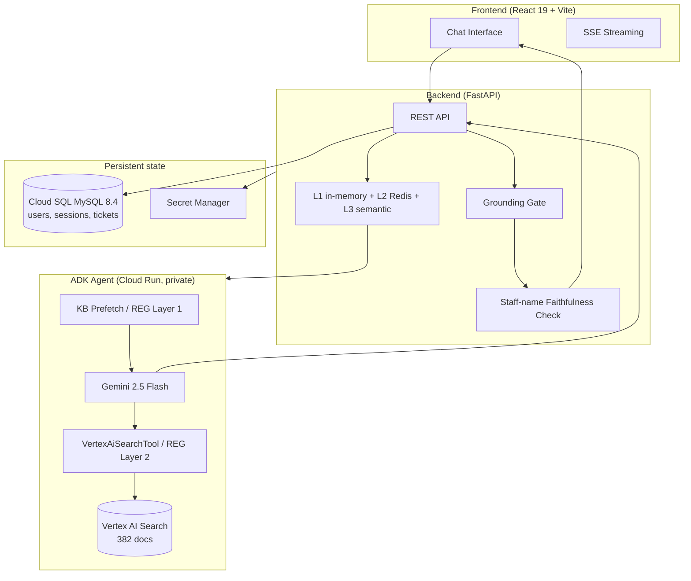

<h1 align="center">ORA Navigator</h1>
<p align="center"><strong>AI Assistant for Morgan State University's Office of Research Administration</strong></p>
<p align="center">
  <a href="https://ora.inavigator.ai">Live App</a> |
  <a href="#architecture">Architecture</a> |
  <a href="#local-development">Local Development</a> |
  <a href="#deployment">Deployment</a>
</p>
<p align="center">
  
  
  
  
</p>

---

ORA Navigator is an AI assistant for Morgan State University's Office of Research Administration (ORA). It serves **faculty, principal investigators, research staff, and department administrators** — not students. Users ask questions about grants, compliance, pre-award, post-award, forms, and ORA staff contacts in plain English and get answers grounded in 382 official documents scraped from `morgan.edu/office-of-research-administration` and its subpages.

Built with Google ADK (Agent Development Kit), Gemini 2.5 Flash, and Vertex AI Search. A **Retrieval-Enforced Generation (REG)** pipeline grounds answers at three layers: KB prefetch (TF-IDF), tool-based retrieval (VertexAiSearchTool), and a post-generation grounding gate + staff-name faithfulness check.

Deployed on Google Cloud Run with multi-instance scaling, Cloud SQL session persistence, and a layered cache (L1 in-memory + L2 Redis + L3 semantic).

---

## What ORA Navigator answers

| Area | Examples |
|---|---|
| **Pre-Award** | F&A and fringe rates · institutional IDs (UEI, EIN, FWA, IRB number) · proposal submission steps · sponsor opportunity databases |
| **Compliance** | IRB approval timeline + meeting schedule · IACUC SOPs (50 documents) · COI disclosure flow · RCR training · Research Security |
| **Post-Award** | NCE (No-Cost Extension) 60-day rule · subaward setup · effort reporting (14-day Searchlight) · final reports (90-day) |
| **Forms & Policies** | PI Handbook policies · 271 forms (PDFs, DocuSign, IACUC SOPs, RACC, D-RED slides) · request templates |
| **Staff routing** | Function-to-staff lookup · ORA staff directory (14 people) · ask.ora@morgan.edu mailing list |

---

## Architecture



### Three services on Cloud Run

| Service | URL | Auth | Purpose |
|---|---|---|---|
| Frontend | `oranavigator-frontend` | public | React UI behind nginx, served at https://ora.inavigator.ai |
| Backend | `oranavigator-backend` | public | FastAPI: auth, sessions, chat orchestration, admin |
| ADK Agent | `oranavigator-adk` | private (backend → ADK only) | Google ADK + Gemini + KB tool |

### GCP resources (project `infra-vertex-494621-v1`)

- **Cloud SQL**: `oranavigator-db` (db-g1-small, us-central1, public IP `34.173.108.181`)
- **Vertex AI Search datastore**: `oranavigator-kb-local` (location `us`, 382 docs)
- **Service account**: `oranavigator-backend@infra-vertex-494621-v1.iam.gserviceaccount.com`
- **Artifact Registry**: `oranavigator` Docker repo in us-central1
- **Secret Manager**: `ora-database-url`, `ora-jwt-secret`, `ora-admin-email`, `ora-admin-password`
- **Domain**: `ora.inavigator.ai` → `oranavigator-frontend` (managed cert)

---

## Tech Stack

- **Frontend**: React 19, Vite, react-router, react-icons, PWA (Vite-PWA)
- **Backend**: FastAPI, SQLAlchemy, bcrypt, JWT auth, cachetools (L1), redis-py (L2), text-embedding-004 cosine (L3)
- **AI Agent**: Google ADK, Gemini 2.5 Flash, Vertex AI Search
- **Database**: Cloud SQL MySQL 8.4 (TCP+SSL locally, unix socket via Cloud SQL Auth Proxy in Cloud Run)
- **Deployment**: Cloud Run, Cloud Build, Artifact Registry, Secret Manager
- **CI/CD**: GitHub Actions (lint, test, health-check; deploys via `deploy-cloudrun.sh`)

---

## Local Development

```bash
# 0. Install Python deps in venv, npm deps in frontend
python -m venv .venv && source .venv/bin/activate
pip install -r backend/requirements.txt
(cd frontend && npm install)

# 1. ADK Agent on port 8081
cd adk_agent && adk web . --port 8081

# 2. Backend on port 5002
cd backend && uvicorn main:app --host 127.0.0.1 --port 5002

# 3. Frontend on port 3001
cd frontend && npm run dev -- --port 3001
```

Copy `.env.example` to `.env` and fill in `DATABASE_URL`, `JWT_SECRET`, `GOOGLE_CLOUD_PROJECT`. See `STARTUP.md` for short version.

Cloud SQL local connection requires your laptop's public IP in the authorized networks list:

```bash
gcloud sql instances patch oranavigator-db \
  --authorized-networks=<your-ip>/32 \
  --project=infra-vertex-494621-v1
```

---

## Knowledge Base

The KB lives at `backend/kb_structured/` as 382 JSON files plus a master `_all_documents.jsonl` index. Files are organized by ORA function:

| Folder | Docs | Purpose |
|---|---:|---|
| `_generated_forms/` | 271 | PDFs, DocuSign, IACUC SOPs, RACC, D-RED, faculty seminars, templates |
| `_generated_compliance/` | 23 | IRB (incl. meeting schedule + voting roster), IACUC, COI, RCR, Research Security |
| `_generated_policies/` | 21 | PI Handbook Section 5 (overview + 20 numbered policies) |
| `_generated_opportunities/` | 15 | Funding databases + sponsor categories |
| `_generated_staff/` | 14 | Staff directory + roles |
| `_generated_pre_award/` | 13 | F&A rates, fringe rates, UEI/EIN/IRB/FWA, proposal steps |
| `_generated_trainings/` | 8 | eTraining, faculty seminars, monthly D-RED, workshops, RACC |
| `_generated_post_award/` | 6 | Setup, NCE, subawards, reporting, forms index |
| `_generated_about/` | 4 | Office overview |
| `_generated_announcements/` | 3 | Compliance leadership transition, Common Forms |
| `_generated_resources/` | 3 | PI handbooks, templates |
| `_generated_service_areas/` | 1 | Function-to-staff routing |
| **Total** | **382** | of which 249 are Playwright-verified |

The 382 JSON files are uploaded to a Vertex AI Search datastore (`oranavigator-kb-local`). The ADK agent queries the datastore at runtime via `VertexAiSearchTool` — it does not read the local files.

---

## Deployment

Cloud Run deploy is handled by `deploy-cloudrun.sh`:

```bash
# Full setup (first time): IAM, secrets, Artifact Registry
./deploy-cloudrun.sh setup

# Deploy all 3 services
./deploy-cloudrun.sh
```

Domain `ora.inavigator.ai` is mapped to `oranavigator-frontend` via Cloud Run domain mapping with a managed TLS cert.

CI (`.github/workflows/ci.yml`) runs on every push: lint, tests, health-check against the live backend and frontend. CI does not auto-deploy.

---

## Security

See `SECURITY.md`. Highlights:

- JWT tokens with bcrypt password hashing
- `.morgan.edu` email domain restriction at signup (auth router enforces)
- Email verification flow
- Grounding gate prevents hallucinated KB facts
- Staff-name faithfulness check appends a disclaimer if the model invents an ORA staff name not on the authoritative list
- CORS restricted to known origins, file upload validation, rate limiting on guest chat and registration

---

## License

MIT — see `LICENSE`.

ORA Navigator was forked from [CS Navigator](https://github.com/lama9811/cs-navigator) on 2026-05-12. The CS Navigator codebase (academic advising for Computer Science students) is maintained independently.
